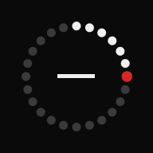

# Day Count

**Days until. Days since.**

A date and a big number. How long until the trip, how long since you stopped
smoking, how many years today. Nothing else.

→ **[stevenjk.github.io/sonic-feels/countdown/](https://stevenjk.github.io/sonic-feels/countdown/)**

Android Chrome. Add it to your home screen and it behaves like an app: opens in
its own window, works with no signal.

## Everything stays on your phone

Built to the same rule as [Sonic Moments](../) next door: **the app makes no
network requests at all** — not one. No account, no backend, no analytics, no
fonts or scripts pulled in from anywhere. The only files it ever asks for are
its own, and the service worker keeps those on the device.

Your dates live in IndexedDB on the phone and never leave it. The flip side is
the same too: clearing site data for the domain in Chrome's settings deletes
them for good, so `EXPORT BACKUP` writes the whole lot to one file worth keeping
somewhere.

## Using it

**Count** — the current event, large. `PREV` / `NEXT` step through the rest, in
the order they'll happen. Under the number: the full date, the same span in
weeks or years, and — for anything with a time on it, on the day or the day
before — a live clock. The row of dots is how far through the wait you are, from
the day you added it (or from last year, for a repeating one).

**Events** — everything, what's coming above what's gone. Tap one to put it on
the Count screen, `EDIT` to change or delete it, and the dot on the right flags
it for milestone alerts.

Events are either one-off or **every year**. A yearly one always counts to the
next time it comes round and tells you which time that is — a 68th birthday, a
17th anniversary. The 29th of February falls back to the 28th in the years it
doesn't exist.

**Milestone alerts** — an optional notification as a flagged date gets close:
100, 50, 30, 14, 7, 3, 2 and 1 days out, then on the day. Deliberately
approximate: see below.

## How it's built

The whole app is **one file** — `index.html`, with the HTML, CSS and JavaScript
inline. No build step, no dependencies, no framework, nothing to install.

The only other files are the ones a PWA can't keep inline: `manifest.webmanifest`,
`sw.js` and `icons/`. The worker caches the app shell and does the milestone
check; no other logic lives outside `index.html`.

| | |
|---|---|
| Storage | IndexedDB |
| Offline | service worker caching the app's own files |
| Alerts | Periodic Background Sync |
| Icon badge | Badging API, where the launcher supports it |

Two things are worth knowing before changing anything:

**Days are counted off a calendar, not a clock.** Subtracting two timestamps and
dividing by 86,400,000 gets the wrong answer twice a year, because the days the
clocks change are 23 and 25 hours long. Every difference in here snaps both ends
to local midnight first and rounds afterwards. For the same reason `2026-08-10`
is split by hand rather than handed to `new Date()`, which reads a bare date as
UTC and lands on the day before for anyone west of Greenwich.

**Alerts can't be scheduled, only hoped for.** Android gives a web app no alarm
clock. Web Push would be precise but needs a server that knows your dates, which
this app refuses to have. So alerts ride on Periodic Background Sync: Chrome
wakes the installed app when it feels like it, and the worker works out whether
a flagged date has crossed a marker since it last looked, announcing only the
most recent one so a run of wake-ups doesn't work backwards through the list. An
alert can be hours late or never arrive. It's a nudge, not a reminder to lean on.

The same limit is why there's no home screen widget: a web app can't draw one.
The icon badge is as close as it gets, and Nothing OS may or may not draw that.
A widget would mean a native Android app — which could still be entirely
offline, but would be a different project.

## Running your own

It has to be served — a service worker won't register from a `file://` URL, so
opening `index.html` off disk gets you a working countdown that forgets it's
installable and won't cache. Any static host will do; every path in the app is
relative, so it doesn't mind living in a subfolder.

The live version is GitHub Pages from `main`. Its worker's scope is this folder
only, so it and Sonic Moments cache independently of each other and neither
touches the other's data.

One quirk to expect once it's deployed: the service worker serves its cached
copy first and refreshes in the background, so a change shows up the *second*
time the app is opened, not the first.
